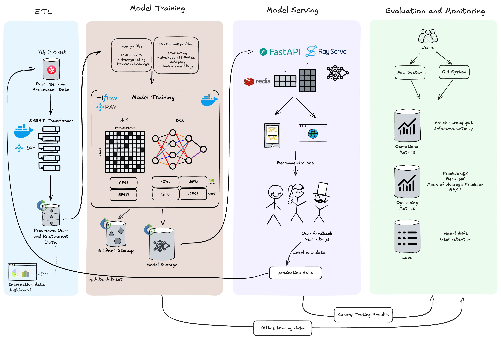

## Restaurant Recommendation System

<!--
Discuss: Value proposition: Your will propose a machine learning system that can be
used in an existing business or service. (You should not propose a system in which
a new business or service would be developed around the machine learning system.)
Describe the value proposition for the machine learning system. What's the (non-ML)
status quo used in the business or service? What business metric are you going to be
judged on? (Note that the "service" does not have to be for general users; you can
propose a system for a science problem, for example.)
-->

The current status quo for restaurant recommendations relies heavily on content based filtering methods. Creating more personalized recommendations removes the hassle of trying to find a place to eat and reduces time spent endlessly scrolling through food apps like Yelp, Google Maps, and Beli. We propose our hybrid model recommendation system to these companies in order to drive up user utility with personalized recommendations. With more effective recommendations, we expect the volume of user reviews to increase, as well as smaller restaurants being able to compete more with established and popular restaurants.

### Contributors

<!-- Table of contributors and their roles.
First row: define responsibilities that are shared by the team.
Then, each row after that is: name of contributor, their role, and in the third column,
you will link to their contributions. If your project involves multiple repos, you will
link to their contributions in all repos here. -->

## Team Contributions

| Name         | Responsible for | Link to their commits in this repo                                                                          |
| ------------ | --------------- | ----------------------------------------------------------------------------------------------------------- |
| Maneesh      | Units - 8       | [Commits - Maneesh](https://github.com/srush-shah/restaurant-recommender/commits/main/?author=Maneeshk11)   |
| Ritesh Ojha  | Units - 3       | [Commits - Ritesh](https://github.com/srush-shah/restaurant-recommender/commits/main/?author=ritzzi23)      |
| Russel Sy    | Units - 4,5     | [Commits - Russel](https://github.com/srush-shah/restaurant-recommender/commits/main/?author=russelgabriel) |
| Srushti Shah | Units - 6,7     | [Commits - Srushti](https://github.com/srush-shah/restaurant-recommender/commits/main/?author=srush-shah)   |

### System diagram



<!-- Overall digram of system. Doesn't need polish, does need to show all the pieces.
Must include: all the hardware, all the containers/software platforms, all the models,
all the data. -->

### Summary of outside materials

<!-- In a table, a row for each dataset, foundation model.
Name of data/model, conditions under which it was created (ideally with links/references),
conditions under which it may be used. -->

|                   | How it was created                                                                                                                                                                                                                                                                                                       | Conditions of use                                                                                           |
| ----------------- | ------------------------------------------------------------------------------------------------------------------------------------------------------------------------------------------------------------------------------------------------------------------------------------------------------------------------ | ----------------------------------------------------------------------------------------------------------- |
| Yelp Open Dataset | The Yelp Open Dataset is a subset of Yelp data that is intended for educational use. It provides real-world data related to businesses including reviews, photos, check-ins, and attributes like hours, parking availability, and ambience.                                                                              | [See detailed ToS here](https://github.com/srush-shah/restaurant-recommender/tree/main/assets/yelp_tos.pdf) |
| SBERT Transformer | Hugging Face used the pretrained microsoft/mpnet-base model and fine-tuned in on a 1B sentence pairs dataset. They used a contrastive learning objective: given a sentence from the pair, the model should predict which out of a set of randomly sampled other sentences, was actually paired with it in their dataset. | [Hugging Face ToS](https://huggingface.co/terms-of-service)                                                 |

### Summary of infrastructure requirements

## Summary of Infrastructure Requirements (Chameleon)

| Requirement                         | How many / When                                      | Justification                                                                                        |
| ----------------------------------- | ---------------------------------------------------- | ---------------------------------------------------------------------------------------------------- |
| **m1.medium VMs**                   | 3 for entire project duration                        | Used for ETL jobs, FastAPI server, Redis, and Ray head node                                          |
| **gpu_a100 or gpu_mi100**           | 4-hour block twice a week                            | Heavy model training (DCN, ALS, SBERT embedding) on large Yelp data                                  |
| **Floating IPs**                    | 1 static IP for entire project duration, 1 on-demand | One for public-facing FastAPI; additional one for staging/monitoring access during canary tests      |
| **Block Storage (100GB)**           | Persistent volume throughout project                 | Store processed Yelp data, user/restaurant embeddings, cached features                               |
| **Object Storage (S3-like)**        | Persistent throughout project                        | Store MLflow artifacts, model checkpoints, and logs                                                  |
| **Docker Registry Access**          | Continuous                                           | For storing/retrieving containerized services (ETL, training, serving)                               |
| **gpu_small VMs (optional)**        | 2 hours weekly (as-needed backup to big GPU)         | Light GPU experimentation or embedding refreshes if gpu_mi100 unavailable                            |
| **Kubernetes Cluster (bare-metal)** | 1 cluster with 3 nodes (2 CPU + 1 GPU)               | To deploy microservices (ETL API, model training jobs, model serving) and support canary deployments |
| **Internal Network**                | Throughout project                                   | For communication between Redis, model server, dashboard, MLflow tracker, etc.                       |

### Rough break down

## Component-to-Node Mapping

| Component                              | Needs?             | Recommended Node Type                                |
| -------------------------------------- | ------------------ | ---------------------------------------------------- |
| **ETL (SBERT embeddings)**             | CPU (GPU optional) | m1.medium (or gpu_small if SBERT is GPU-accelerated) |
| **Model Training (ALS/DCN)**           | GPU-intensive      | gpu_mi100 or gpu_a100                                |
| **Model Serving (FastAPI + RayServe)** | CPU                | m1.medium                                            |
| **Redis (caching)**                    | CPU                | m1.small or m1.medium                                |
| **MLflow (tracking + registry)**       | CPU                | m1.small                                             |
| **Dashboard (Grafana/Prometheus)**     | CPU                | m1.small                                             |
| **Canary / Staging Env**               | CPU                | m1.medium (on-demand/scheduled)                      |
| **Load Testing (Optional)**            | CPU                | Ephemeral VM (as-needed only)                        |

## VM Breakdown

| VM Purpose                    | VM Type   | Count               | Notes                                           |
| ----------------------------- | --------- | ------------------- | ----------------------------------------------- |
| **Ray Cluster Head Node**     | m1.medium | 1                   | Controls Ray tasks, does some orchestration     |
| **Ray Worker Node (CPU)**     | m1.medium | 1–2                 | For ETL, inference, lightweight model serving   |
| **GPU Training Node**         | gpu_mi100 | On demand (2x/week) | For SBERT/DCN/ALS training (can be preemptible) |
| **Redis & MLflow**            | m1.small  | 1                   | Can be co-hosted if needed                      |
| **Canary/Testing Node**       | m1.medium | 1 (as needed)       | Used only during staged testing                 |
| **Dashboard Node (optional)** | m1.small  | 1                   | Optional unless you're monitoring live stats    |

Note: It is subject to change as we implement.

### Detailed design plan

<!-- In each section, you should describe (1) your strategy, (2) the relevant parts of the
diagram, (3) justification for your strategy, (4) relate back to lecture material,
(5) include specific numbers. -->

#### Model training and training platforms

**Unit 4 Requirements:**

1. **Train and Re-train**:

   - Candidate generation
     - Train an Alternating Least Squares (ALS) model on a user-restaurant interaction matrix
     - Retrain as new users with enough ratings get added to the matrix, existing users give more ratings, new restaurants get new ratings
   - Ranking the candidates
     - Train a Deep and Cross Network (DCN) on user and restaurants features to capture the interaction effects between the features and generate more accurate ratings.
     - Can play with penalties to reward diversity and serendipity in recommendations
   - Continuous retraining pipeline using production feedback data
   - Model artifacts stored in versioned storage for reproducibility

2. **Modeling Choices**:
   - ALS for sparse user-restaurant interaction matrix for candidate generation. This reduces the number of potential restaurant recommendations from hundreds of thousands to just hundreds.
   - DCN for handling complex feature interactions between user and restaurant profiles to generate a more accurate ranking/order of recommendations.

**Unit 5 Requirements:**

1. **Experiment Tracking**:

   - MLflow deployment on Chameleon for experiment management
   - Tracking of model metrics, hyperparameters, and artifacts
   - Automated logging of training metrics and model performance
   - Version control of model artifacts and configurations

2. **Training Job Scheduling**:
   - Ray cluster deployment for distributed training of DCN
   - GPU resource management (NVIDIA and AMD)
   - Automated job scheduling and resource allocation
   - Integration with continuous training pipeline

**Unit 5 Difficulty Points:**

1. **Ray Train Implementation**:

   - Fault-tolerant training with automatic checkpointing
   - Remote artifact storage integration
   - Distributed training across GPU nodes for DCN
   - Automatic failover and recovery

2. **Hyperparameter Tuning**:
   - Ray Tune integration for automated optimization of both models
   - Multi-objective optimization for latency-accuracy trade-offs
   - Parallel trial execution across available GPUs

#### Model serving and monitoring platforms

## Unit 6 & 7: Serving, Optimization, Evaluation & Monitoring

### 1. Serving from an API Endpoint

- **FastAPI service** implemented in [monitoring/app.py](https://github.com/srush-shah/restaurant-recommender/blob/main/monitoring/app.py)
- The `/recommend` POST endpoint loads in-memory user/item embeddings (from CSVs), computes dot-product scores, and returns top-K recommendations
- Instrumented with `prometheus-fastapi-instrumentator` to expose metrics at `/metrics` endpoint for monitoring
- Complete Docker setup for deployment:
  - [monitoring/docker-compose-fastapi.yaml](https://github.com/srush-shah/restaurant-recommender/blob/main/monitoring/docker-compose-fastapi.yaml) orchestrates the FastAPI server, Prometheus, and Grafana
  - [monitoring/Dockerfile](https://github.com/srush-shah/restaurant-recommender/blob/main/monitoring/Dockerfile) defines the container setup

### 2. Identifying Requirements

After thorough benchmarking and optimization experiments documented in [model_optim.ipynb](https://github.com/srush-shah/restaurant-recommender/blob/main/model_optim.ipynb), we've established the following requirements for our restaurant recommendation system:

#### Model Requirements

- **Model Size**: ≤ 0.2 MB on disk (INT8 quantized model achieved 0.15 MB)
- **Inference Latency**: p95 ≤ 0.1 ms per individual request (achieved 0.08-0.10 ms)
- **Accuracy**: Maintain consistent 33.9% accuracy for rounded predictions (quantized model shows minimal accuracy loss of 0.01%)

#### Service Requirements

- **Request Processing Rate**: Support ≥ 500,000 recommendations per second in batch mode
- **Concurrency**: Handle ≥ 100 simultaneous user connections
- **Response Time**: Maintain p95 latency ≤ 50 ms for end-to-end API requests
- **Availability**: 99.9% uptime with automated health checks and service recovery
- **Scalability**: Ability to scale horizontally based on traffic patterns

#### System Requirements

- **Memory Usage**: ≤ 500 MB RAM for API server instance
- **Storage**: Efficient handling of user and restaurant embedding vectors (≤ 1 GB total)
- **Monitoring**: Real-time metrics for request rate, latency, error rate, and model prediction distribution
- **Deployment**: Containerized deployment with orchestration via Docker Compose
- **Security**: Proper authentication and rate limiting to prevent abuse

### 3. Model Optimizations

- Implemented JIT tracing and ONNX export in [model_optim.ipynb](https://github.com/srush-shah/restaurant-recommender/blob/main/model_optim.ipynb)
- Applied dynamic INT8 quantization using ONNX Runtime's `quantize_dynamic`
- Generated optimized models in the [models/](https://github.com/srush-shah/restaurant-recommender/tree/main/models) directory
- Benchmarked all model variants to identify optimal tradeoffs between size, latency, and accuracy
- The quantized ONNX model (INT8) provides the optimal balance between performance and resource usage, reducing model size by 74% (from 0.57 MB to 0.15 MB) while maintaining prediction accuracy and providing excellent inference speed

### 4. Monitoring Infrastructure

- Complete monitoring stack set up in [monitoring/docker-compose-fastapi.yaml](https://github.com/srush-shah/restaurant-recommender/blob/main/monitoring/docker-compose-fastapi.yaml):
  - **Prometheus**: Configured to scrape metrics from the FastAPI service
  - **Grafana**: Pre-configured dashboards for visualizing performance metrics
- Monitoring configuration:
  - [monitoring/prometheus.yml](https://github.com/srush-shah/restaurant-recommender/blob/main/monitoring/prometheus.yml) defines scraping targets
  - [monitoring/grafana_dashboard.json](https://github.com/srush-shah/restaurant-recommender/blob/main/monitoring/grafana_dashboard.json) provides a comprehensive dashboard for:
    - Request rate (RPS)
    - Latency percentiles (p95, p99)
    - Error rates
    - System resource utilization

### 5. Integration with MLflow Tracking

- Added functionality to start MLflow tracking services via:
  - [ml_train_docker/docker-compose-mlflow.yaml](https://github.com/srush-shah/restaurant-recommender/blob/main/ml_train_docker/docker-compose-mlflow.yaml)
  - Services include MLflow server, MinIO for artifact storage, and PostgreSQL for experiment metadata
- Integrated into the [monitoring/start_services.sh](https://github.com/srush-shah/restaurant-recommender/blob/main/monitoring/start_services.sh) script for seamless deployment

### 6. Deployment Automation

- Created a unified deployment script [monitoring/start_services.sh](https://github.com/srush-shah/restaurant-recommender/blob/main/monitoring/start_services.sh) that:
  - Provisions Grafana configuration automatically
  - Starts all required containers in the correct order
  - Performs health checks to ensure all services are running correctly
  - Provides clear status information and service endpoints

### Running the System

To start all services (MLflow tracking, FastAPI server, Prometheus, and Grafana):

```bash
cd ~/restaurant-recommender
bash monitoring/start_services.sh
```

Services will be available at:

- FastAPI: http://localhost:8000
- Prometheus: http://localhost:9090
- Grafana: http://localhost:3000 (admin/admin)
- MLflow: http://localhost:5000
- MinIO: http://localhost:9001 (user: your-access-key, password: your-secret-key)

#### Data pipeline

**Unit 8: Data Pipeline Implementation**

The data pipeline implementation in our restaurant recommendation system provides robust infrastructure for handling large-scale Yelp data, transforming it for model training, and making it accessible for system components. As evidenced in the [data-pipeline](https://github.com/srush-shah/restaurant-recommender/tree/main/data-pipeline) directory, we've implemented:

1. **ETL Pipeline for ALS Model Training**:

   - [als-etl](https://github.com/srush-shah/restaurant-recommender/tree/main/data-pipeline/als-etl) contains a comprehensive extraction, transformation, and loading pipeline
   - Implemented a [transform.py](https://github.com/srush-shah/restaurant-recommender/tree/main/data-pipeline/als-etl/scripts/transform.py) script that handles:
     - Memory-efficient processing of large Yelp datasets using chunking techniques
     - Category encoding and vectorization for restaurant features
     - K-core filtering to remove sparse user-item interactions
     - Train-test-validation splitting with stratification on businees and user ids for robust model evaluation
     - Data validation and quality assurance
   - Containerized with Docker for reproducible, scalable processing ([docker-compose-als-etl.yaml](https://github.com/srush-shah/restaurant-recommender/tree/main/data-pipeline/als-etl/docker-compose-als-etl.yaml))
   - Resource-optimized configuration for efficient execution on Chameleon nodes

2. **Feature Enriching Pipeline for DCN Training**:

   - [dcn-etl](https://github.com/srush-shah/restaurant-recommender/tree/main/data-pipeline/dcn_etl) builds on the ALS model outputs to prepare training data for the Deep & Cross Network (DCN)
   - Extracts latent vectors from the trained ALS model and merges them with raw data:
     - Fetches user and item embeddings from object storage
     - Joins these embeddings with the original review dataset
     - Creates enriched feature vectors combining ratings with learned latent factors
   - Implements time-based train/validation/production splits:
     - Uses chronological ordering to simulate real-world prediction scenarios
     - Ensures newer data is used for validation and production testing
   - Memory-efficient processing with DataFrame chunking for handling large datasets
   - Full containerization with managed dependencies ([docker-compose-dcn-etl.yaml](https://github.com/srush-shah/restaurant-recommender/tree/main/data-pipeline/dcn_etl/docker-compose-dcn-etl.yaml))
   - Orchestrated through a single command with the [etl.sh](https://github.com/srush-shah/restaurant-recommender/tree/main/data-pipeline/dcn_etl/etl.sh) script

3. **Interactive Data Quality Dashboard**:

   - [als-dashboard](https://github.com/srush-shah/restaurant-recommender/tree/main/data-pipeline/als-dashboard) provides a comprehensive Streamlit-based interactive dashboard
   - Latest implementation includes advanced data quality monitoring with six key analysis sections:
     - Data Overview: Basic statistics, memory usage, and sample data preview
     - Data Quality: Missing values analysis, duplicate records detection, and data type distribution
     - Stars Analysis: Restaurant ratings distribution and trends over time
     - Cities Analysis: Geographic distribution of ratings and restaurant density by location
     - Distribution Analysis: Interactive histograms and box plots for numerical features
     - Correlation Analysis: Feature relationship visualization through heatmaps and scatter plots
   - Automated data loading from Chameleon Object Storage using rclone with robust error handling
   - Enhanced configurability through Docker with an improved [run_dashboard.sh](https://github.com/srush-shah/restaurant-recommender/tree/main/data-pipeline/als-dashboard/run_dashboard.sh) script for one-command deployment
   - Real-time visualization with Plotly for interactive exploration of data patterns and anomalies

4. **Persistent Storage Management**:

   - Multiple [docker-compose](https://github.com/srush-shah/restaurant-recommender/tree/main/data-pipeline/docker-compose-raw-data.yaml) configurations for different data storage needs
   - Automated data extraction and uploads to object storage
   - Structured organization of raw, intermediate, and processed data
   - Mount point management for volume persistence between runs

5. **Orchestration and Automation**:
   - Shell scripts for coordinating pipeline components ([etl.sh](https://github.com/srush-shah/restaurant-recommender/tree/main/data-pipeline/als-etl/etl.sh))
   - Monitoring utilities for tracking processing progress
   - Resource management to prevent memory overflow during large data processing
   - Error handling and logging systems for debugging and audit trails

The pipeline has been designed with scale, efficiency, and reproducibility in mind, aiming for integration with our model training and serving components, while ensuring data quality throughout the recommendation system lifecycle.

#### Continuous X

Implementations of Continuous X automated workflows for our use-case:

1. **Continuous Integration/Deployment**:

   - Automated model training pipeline using MLflow and Ray
   - Containerized deployment using FastAPI and RayServe
   - Canary testing for new model versions before production deployment

2. **Continuous Monitoring**:

   - Real-time tracking of operational metrics (batch throughput, inference latency)
   - Model performance metrics (Precision@K, Recall@K, Mean Average Precision, RMSE)
   - User engagement and retention metrics
   - Automated model drift detection

3. **Continuous Learning**:
   - Integration of production feedback into training pipeline
   - Automated model retraining based on performance thresholds
   - A/B testing between new and old system versions

This satisfies Unit 3 requirements through automated testing, deployment, and monitoring pipelines.
