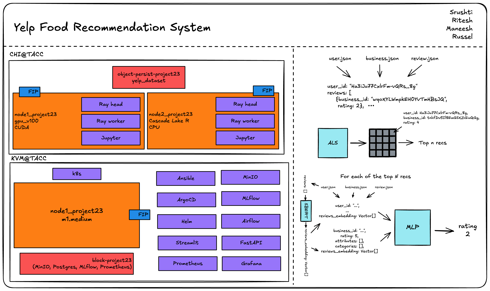

## Restaurant Recommendation System

<!--
Discuss: Value proposition: Your will propose a machine learning system that can be
used in an existing business or service. (You should not propose a system in which
a new business or service would be developed around the machine learning system.)
Describe the value proposition for the machine learning system. What's the (non-ML)
status quo used in the business or service? What business metric are you going to be
judged on? (Note that the "service" does not have to be for general users; you can
propose a system for a science problem, for example.)
-->

The current status quo for restaurant recommendations relies heavily on content-based filtering methods. Creating more personalized recommendations removes the hassle of finding a place to eat and reduces time spent endlessly scrolling through food apps like Yelp, Google Maps, and Beli. With Yelp publishing their open dataset, we saw this as an opportunity to improve on their current recommendation system and present our own hybrid model recommendation system to drive up user utility of the Yelp app through more personalized recommendations. 

Yelp's open dataset has a rich combination of business attributes (like categories, price range, and location), user data (including review history and social connections), and millions of textual reviews and explicit star ratings. The wide range of features makes for perfect data to train a neural network on. Additionally, the millions of reviews are the ideal input for a collaborative filtering matrix factorization model like ALS. All in all, Yelp’s open dataset contains 9.6GB of JSON data. With this dataset, we were able to train a lightweight 100kb MLP model, as well as around 100MB worth of latent user and restaurant vectors from the ALS model. 


### Contributors

<!-- Table of contributors and their roles.
First row: define responsibilities that are shared by the team.
Then, each row after that is: name of contributor, their role, and in the third column,
you will link to their contributions. If your project involves multiple repos, you will
link to their contributions in all repos here. -->

## Team Contributions

| Name         | Responsible for | Link to their commits in this repo                                                                          |
| ------------ | --------------- | ----------------------------------------------------------------------------------------------------------- |
| Maneesh      | Units - 8       | [Commits - Maneesh](https://github.com/srush-shah/restaurant-recommender/commits/main/?author=Maneeshk11)   |
| Ritesh Ojha  | Units - 3       | [Commits - Ritesh](https://github.com/srush-shah/restaurant-recommender/commits/main/?author=ritzzi23)      |
| Russel Sy    | Units - 4,5     | [Commits - Russel](https://github.com/srush-shah/restaurant-recommender/commits/main/?author=russelgabriel) |
| Srushti Shah | Units - 6,7     | [Commits - Srushti](https://github.com/srush-shah/restaurant-recommender/commits/main/?author=srush-shah)   |

### System diagram



<!-- Overall digram of system. Doesn't need polish, does need to show all the pieces.
Must include: all the hardware, all the containers/software platforms, all the models,
all the data. -->

### Summary of outside materials

<!-- In a table, a row for each dataset, foundation model.
Name of data/model, conditions under which it was created (ideally with links/references),
conditions under which it may be used. -->

|                   | How it was created                                                                                                                                                                                                                                                                                                       | Conditions of use                                                                                           |
| ----------------- | ------------------------------------------------------------------------------------------------------------------------------------------------------------------------------------------------------------------------------------------------------------------------------------------------------------------------ | ----------------------------------------------------------------------------------------------------------- |
| Yelp Open Dataset | The Yelp Open Dataset is a subset of Yelp data that is intended for educational use. It provides real-world data related to businesses including reviews, photos, check-ins, and attributes like hours, parking availability, and ambience.                                                                              | [See detailed ToS here](https://github.com/srush-shah/restaurant-recommender/tree/main/assets/yelp_tos.pdf) |
| SBERT Transformer | Hugging Face used the pretrained microsoft/mpnet-base model and fine-tuned in on a 1B sentence pairs dataset. They used a contrastive learning objective: given a sentence from the pair, the model should predict which out of a set of randomly sampled other sentences, was actually paired with it in their dataset. | [Hugging Face ToS](https://huggingface.co/terms-of-service)                                                 |

#### Continuous X

We are using imperative style (python-chi) to deploy our infrastructure. The code lives in GIT. I have used a combination of tools python-chi, ansible, ArgoCD, Argo Workflows, Helm.


Infrastructure as code :

https://github.com/srush-shah/restaurant-recommender/tree/main/infra/infra_final

We first start with running:
 setting_up_gpu_with_mlflow_mnio.ipynb : 
This notebook provisions a bare-metal GPU instance on Chameleon Cloud using a reserved lease, attaches a floating IP, and installs Docker with NVIDIA Container Toolkit for GPU access. It configures and runs a JupyterLab container (torchnb) and an MLflow tracking container (mlflow), both with GPU support. Additionally, it mounts Chameleon object storage via rclone for persistent data access inside the containers.

vm_resources_deployment.ipynb
The notebook automates provisioning of a KVM virtual machine on Chameleon Cloud (KVM@TACC) with a medium flavor and Ubuntu 24.04 image. It attaches a floating IP, sets up custom security groups for key services (SSH, MLFlow, Jupyter, etc.), installs Docker, and mounts object storage using rclone. Finally, it starts essential services like Grafana, Prometheus, and JupyterLab inside containers for end-to-end monitoring and experimentation.


Cloud-native:
https://github.com/srush-shah/restaurant-recommender/tree/main/ml_train_docker

https://github.com/srush-shah/restaurant-recommender/tree/main/infra/updated_scripts/data_infra

We followed a cloud-native, immutable infrastructure approach by avoiding manual "clickops" and ensuring all provisioning and configuration is done through version-controlled code. The repository includes multiple purpose-built Dockerfiles and Docker Compose manifests (for Airflow, MLflow, Ray, Jupyter, MinIO, etc.), enabling reproducible deployments across both CPU and GPU environments (CUDA and ROCm). We have made sure that the object storage and block storage are also made through code. All infrastructure components are containerized and declaratively managed, promoting scalability and portability.

CI/CD and continuous Training:

infra/infra_final/retrain_jobs.sh
infra/DAGs/staging_flow_1.py

To enable automated model retraining, we implemented a CI/CD loop using a hybrid of Airflow DAGs and Ray Train jobs. The DAG (staging_flow_1.py) triggers every two weeks to sequentially submit als_train.py and mlp_train.py training jobs to a Ray cluster. A complementary shell script (retrain_jobs.sh) provides a manual fallback for ad hoc retraining. While the final model wasn’t ready until late, this framework lays the groundwork for continuous learning, and can be improved further with more advanced feedback and evaluation strategies.


Staged deployment:

infra/infra_final/deploying_canary_staging_prod.ipynb

Restaurant-recommender-iac


infra/DAGs/staging_flow_1.py

This was one of the most challenging parts of the project. I tried to follow the lab scripts and adapted them to build a complete ML lifecycle pipeline using Ansible and ArgoCD. I created a Python- file based that triggers training, builds a container, and deploys it to staging, canary, and production environments. Everything is managed through code using ArgoCD and infrastructure-as-code files from the restaurant-recommender-iac repo. I also explored an alternative approach Airflow DAG  by exposing 3 different ports on a single container and using Airflow to test and promote across stages. It still has room for improvement, but it sets up a working feedback and deployment loop.


Finally I added scripts to remove all the resources.
vm_delete_resources.ipynb
gpu_delete_resources.ipynb

#### Model Training

We chose to split this restaurant recommendation problem into two parts: candidate generation and candidate ranking. The main goal of candidate generation is to shrink the massive pool of potential candidates to a more manageable size to perform more fine-tuned rating predictions on. With the size of reviews.json, we were able to build a global utility matrix to train a global ALS model covering users and restaurants across the United States. We chose to train an ALS model since it can effectively handle large and sparse datasets, like the utility matrix we constructed with user and restaurant reviews, making it scalable. This matrix factorization technique also learns latent factors representing user and item preferences, allowing for fairly accurate prediction of user-item, or in our case, user-restaurant interaction.

Once the user and restaurant latent factors are learned, a user can choose a city that they are in, and then the recommendation system begins. The dot product between that user’s latent vector and every other restaurant in that city is calculated, resulting in a predicted rating for every possible restaurant. We then take the top 100 restaurants for re-ranking. Since this model doesn’t take into account any of the content-based features from that restaurant, our next step was to use a model that does take into account the other rich features in the dataset to more accurately predict a user’s rating for that restaurant. We chose to train a simple MLP since it can handle a diverse range of input features, and our input data would have both categorical and non-categorical data. We would one hot encode the restaurant’s categorical features, while also including the latent vectors from the ALS model, as well text review embeddings.

We gathered these review text embeddings by running the text review through a Hugging Face BERT model, specifically bert-small model due to the amount of text data we had to process, as well as our limited GPU access. For each restaurant and user, we would get all their respective review embeddings and create an aggregate or averaged embedding which can now be used as another input feature for the MLP. 


#### Model serving and monitoring platforms

## Unit 6 & 7: Serving, Optimization, Evaluation & Monitoring

### 1. Serving from an API Endpoint

- **FastAPI service** implemented in [monitoring/app.py](https://github.com/srush-shah/restaurant-recommender/blob/main/monitoring/app.py)
- The `/recommend` POST endpoint loads in-memory user/item embeddings (from CSVs), computes dot-product scores, and returns top-K recommendations
- Instrumented with `prometheus-fastapi-instrumentator` to expose metrics at `/metrics` endpoint for monitoring
- Complete Docker setup for deployment:
  - [monitoring/docker-compose-fastapi.yaml](https://github.com/srush-shah/restaurant-recommender/blob/main/monitoring/docker-compose-fastapi.yaml) orchestrates the FastAPI server, Prometheus, and Grafana
  - [monitoring/Dockerfile](https://github.com/srush-shah/restaurant-recommender/blob/main/monitoring/Dockerfile) defines the container setup

### 2. Identifying Requirements

After thorough benchmarking and optimization experiments documented in [model_optim.ipynb](https://github.com/srush-shah/restaurant-recommender/blob/main/model_optim.ipynb), we've established the following requirements for our restaurant recommendation system:

#### Model Requirements

- **Model Size**: ≤ 0.2 MB on disk (INT8 quantized model achieved 0.15 MB)
- **Inference Latency**: p95 ≤ 0.1 ms per individual request (achieved 0.08-0.10 ms)
- **Accuracy**: Maintain consistent 33.9% accuracy for rounded predictions (quantized model shows minimal accuracy loss of 0.01%)

#### Service Requirements

- **Request Processing Rate**: Support ≥ 500,000 recommendations per second in batch mode
- **Concurrency**: Handle ≥ 100 simultaneous user connections
- **Response Time**: Maintain p95 latency ≤ 50 ms for end-to-end API requests
- **Availability**: 99.9% uptime with automated health checks and service recovery
- **Scalability**: Ability to scale horizontally based on traffic patterns

#### System Requirements

- **Memory Usage**: ≤ 500 MB RAM for API server instance
- **Storage**: Efficient handling of user and restaurant embedding vectors (≤ 1 GB total)
- **Monitoring**: Real-time metrics for request rate, latency, error rate, and model prediction distribution
- **Deployment**: Containerized deployment with orchestration via Docker Compose
- **Security**: Proper authentication and rate limiting to prevent abuse

### 3. Model Optimizations

- Implemented JIT tracing and ONNX export in [model_optim.ipynb](https://github.com/srush-shah/restaurant-recommender/blob/main/model_optim.ipynb)
- Applied dynamic INT8 quantization using ONNX Runtime's `quantize_dynamic`
- Generated optimized models in the [models/](https://github.com/srush-shah/restaurant-recommender/tree/main/models) directory
- Benchmarked all model variants to identify optimal tradeoffs between size, latency, and accuracy
- The quantized ONNX model (INT8) provides the optimal balance between performance and resource usage, reducing model size by 74% (from 0.57 MB to 0.15 MB) while maintaining prediction accuracy and providing excellent inference speed

### 4. Monitoring Infrastructure

- Complete monitoring stack set up in [monitoring/docker-compose-fastapi.yaml](https://github.com/srush-shah/restaurant-recommender/blob/main/monitoring/docker-compose-fastapi.yaml):
  - **Prometheus**: Configured to scrape metrics from the FastAPI service
  - **Grafana**: Pre-configured dashboards for visualizing performance metrics
- Monitoring configuration:
  - [monitoring/prometheus.yml](https://github.com/srush-shah/restaurant-recommender/blob/main/monitoring/prometheus.yml) defines scraping targets
  - [monitoring/grafana_dashboard.json](https://github.com/srush-shah/restaurant-recommender/blob/main/monitoring/grafana_dashboard.json) provides a comprehensive dashboard for:
    - Request rate (RPS)
    - Latency percentiles (p95, p99)
    - Error rates
    - System resource utilization

### 5. Integration with MLflow Tracking

- Added functionality to start MLflow tracking services via:
  - [ml_train_docker/docker-compose-mlflow.yaml](https://github.com/srush-shah/restaurant-recommender/blob/main/ml_train_docker/docker-compose-mlflow.yaml)
  - Services include MLflow server, MinIO for artifact storage, and PostgreSQL for experiment metadata
- Integrated into the [monitoring/start_services.sh](https://github.com/srush-shah/restaurant-recommender/blob/main/monitoring/start_services.sh) script for seamless deployment

### 6. Deployment Automation

- Created a unified deployment script [monitoring/start_services.sh](https://github.com/srush-shah/restaurant-recommender/blob/main/monitoring/start_services.sh) that:
  - Provisions Grafana configuration automatically
  - Starts all required containers in the correct order
  - Performs health checks to ensure all services are running correctly
  - Provides clear status information and service endpoints

### Running the System

To start all services (MLflow tracking, FastAPI server, Prometheus, and Grafana):

```bash
cd ~/restaurant-recommender
bash monitoring/start_services.sh
```

Services will be available at:

- FastAPI: http://localhost:8000
- Prometheus: http://localhost:9090
- Grafana: http://localhost:3000 (admin/admin)
- MLflow: http://localhost:5000
- MinIO: http://localhost:9001 (user: your-access-key, password: your-secret-key)

#### Data pipeline

**Unit 8: Data Pipeline Implementation**

The data pipeline implementation in our restaurant recommendation system provides robust infrastructure for handling large-scale Yelp data, transforming it for model training, and making it accessible for system components. As evidenced in the [data-pipeline](https://github.com/srush-shah/restaurant-recommender/tree/main/data-pipeline) directory, we've implemented:

1. **ETL Pipeline for ALS Model Training**:

   - [als-etl](https://github.com/srush-shah/restaurant-recommender/tree/main/data-pipeline/als-etl) contains a comprehensive extraction, transformation, and loading pipeline
   - Implemented a [transform.py](https://github.com/srush-shah/restaurant-recommender/tree/main/data-pipeline/als-etl/scripts/transform.py) script that handles:
     - Memory-efficient processing of large Yelp datasets using chunking techniques
     - Category encoding and vectorization for restaurant features
     - K-core filtering to remove sparse user-item interactions
     - Train-test-validation splitting with stratification on businees and user ids for robust model evaluation
     - Data validation and quality assurance
   - Containerized with Docker for reproducible, scalable processing ([docker-compose-als-etl.yaml](https://github.com/srush-shah/restaurant-recommender/tree/main/data-pipeline/als-etl/docker-compose-als-etl.yaml))
   - Resource-optimized configuration for efficient execution on Chameleon nodes

2. **Feature Enriching Pipeline for DCN Training**:

   - [dcn-etl](https://github.com/srush-shah/restaurant-recommender/tree/main/data-pipeline/dcn_etl) builds on the ALS model outputs to prepare training data for the Deep & Cross Network (DCN)
   - Extracts latent vectors from the trained ALS model and merges them with raw data:
     - Fetches user and item embeddings from object storage
     - Joins these embeddings with the original review dataset
     - Creates enriched feature vectors combining ratings with learned latent factors
   - Implements time-based train/validation/production splits:
     - Uses chronological ordering to simulate real-world prediction scenarios
     - Ensures newer data is used for validation and production testing
   - Memory-efficient processing with DataFrame chunking for handling large datasets
   - Full containerization with managed dependencies ([docker-compose-dcn-etl.yaml](https://github.com/srush-shah/restaurant-recommender/tree/main/data-pipeline/dcn_etl/docker-compose-dcn-etl.yaml))
   - Orchestrated through a single command with the [etl.sh](https://github.com/srush-shah/restaurant-recommender/tree/main/data-pipeline/dcn_etl/etl.sh) script

3. **Interactive Data Quality Dashboard**:

   - [als-dashboard](https://github.com/srush-shah/restaurant-recommender/tree/main/data-pipeline/als-dashboard) provides a comprehensive Streamlit-based interactive dashboard
   - Latest implementation includes advanced data quality monitoring with six key analysis sections:
     - Data Overview: Basic statistics, memory usage, and sample data preview
     - Data Quality: Missing values analysis, duplicate records detection, and data type distribution
     - Stars Analysis: Restaurant ratings distribution and trends over time
     - Cities Analysis: Geographic distribution of ratings and restaurant density by location
     - Distribution Analysis: Interactive histograms and box plots for numerical features
     - Correlation Analysis: Feature relationship visualization through heatmaps and scatter plots
   - Automated data loading from Chameleon Object Storage using rclone with robust error handling
   - Enhanced configurability through Docker with an improved [run_dashboard.sh](https://github.com/srush-shah/restaurant-recommender/tree/main/data-pipeline/als-dashboard/run_dashboard.sh) script for one-command deployment
   - Real-time visualization with Plotly for interactive exploration of data patterns and anomalies

4. **Persistent Storage Management**:

   - Multiple [docker-compose](https://github.com/srush-shah/restaurant-recommender/tree/main/data-pipeline/docker-compose-raw-data.yaml) configurations for different data storage needs
   - Automated data extraction and uploads to object storage
   - Structured organization of raw, intermediate, and processed data
   - Mount point management for volume persistence between runs

5. **Orchestration and Automation**:
   - Shell scripts for coordinating pipeline components ([etl.sh](https://github.com/srush-shah/restaurant-recommender/tree/main/data-pipeline/als-etl/etl.sh))
   - Monitoring utilities for tracking processing progress
   - Resource management to prevent memory overflow during large data processing
   - Error handling and logging systems for debugging and audit trails

The pipeline has been designed with scale, efficiency, and reproducibility in mind, aiming for integration with our model training and serving components, while ensuring data quality throughout the recommendation system lifecycle.

#### Continuous X

Implementations of Continuous X automated workflows for our use-case:

1. **Continuous Integration/Deployment**:

   - Automated model training pipeline using MLflow and Ray
   - Containerized deployment using FastAPI and RayServe
   - Canary testing for new model versions before production deployment

2. **Continuous Monitoring**:

   - Real-time tracking of operational metrics (batch throughput, inference latency)
   - Model performance metrics (Precision@K, Recall@K, Mean Average Precision, RMSE)
   - User engagement and retention metrics
   - Automated model drift detection

3. **Continuous Learning**:
   - Integration of production feedback into training pipeline
   - Automated model retraining based on performance thresholds
   - A/B testing between new and old system versions

This satisfies Unit 3 requirements through automated testing, deployment, and monitoring pipelines.
